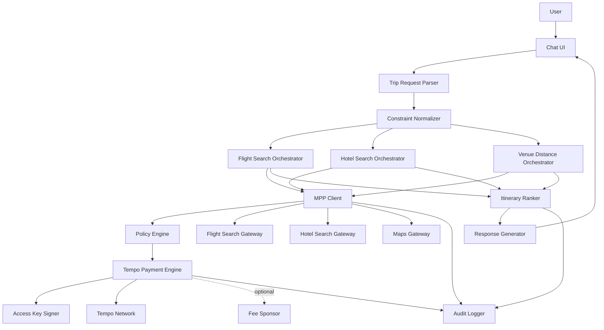
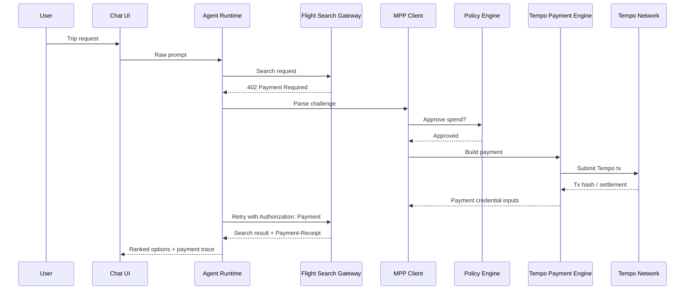

# Conference Trip Agent Architecture

## Overview

This document turns the product spec in [README.md](README.md) into an implementation-oriented architecture.

The system is intentionally narrow:

- one chat-driven trip planning workflow
- one Tempo-backed runtime identity
- one payment path for paid travel-search services
- one response format for ranked trip options

## 1. System Boundary

```text
User
  |
  v
Chat UI
  |
  v
Conference Trip Agent Runtime
  |
  +--> Flight Search Gateway (paid via MPP)
  +--> Hotel Search Gateway (paid via MPP)
  +--> Optional Maps/Commute Gateway (paid via MPP)
  |
  +--> Tempo Network
  +--> Optional Fee Sponsor
```

Tempo is used for:

- runtime identity and bounded authorization
- transaction signing
- payment of machine services
- payment receipts and spend auditability

External travel gateways are used for:

- flight search
- hotel search
- venue distance or commute-time enrichment

## 2. High-Level Component Graph



## 3. Runtime Modules

### Chat UI

Responsibilities:

- accept user requests
- show progress
- render ranked options
- display payment trace

### Trip Request Parser

Responsibilities:

- parse user text
- identify destination, dates, budget, and constraints
- detect missing required fields

Output:

- `ConferenceTripRequest`

### Constraint Normalizer

Responsibilities:

- normalize cities and airports
- normalize date windows
- translate user language into strict filters

Output:

- `NormalizedTripRequest`

### Flight Search Orchestrator

Responsibilities:

- prepare flight search payloads
- call paid flight search services
- normalize service-specific responses into shared flight candidates

### Hotel Search Orchestrator

Responsibilities:

- prepare hotel search payloads
- call paid hotel search services
- normalize hotel results into shared hotel candidates

### Venue Distance Orchestrator

Responsibilities:

- enrich hotel results with venue distance or commute-time data
- drop invalid hotels when location constraints exist

### MPP Client

Responsibilities:

- send search requests
- process `402 Payment Required`
- parse `WWW-Authenticate: Payment`
- choose Tempo method
- retry with `Authorization: Payment`
- collect `Payment-Receipt`

### Tempo Payment Engine

Responsibilities:

- build Tempo `0x76` transactions
- choose fee token
- apply `valid_before`
- route through sponsorship if enabled
- submit payment transaction

### Access Key Signer

Responsibilities:

- hold the runtime access key
- sign Tempo payment transactions
- never expose the root key

### Policy Engine

Responsibilities:

- service allowlist enforcement
- spend authorization
- budget enforcement
- escalation conditions

### Itinerary Ranker

Responsibilities:

- build valid flight + hotel combinations
- enforce hard constraints
- score and rank combinations

### Response Generator

Responsibilities:

- generate final structured response
- generate user-friendly explanation
- include payment trace

### Audit Logger

Responsibilities:

- log task lifecycle
- log all service calls
- log MPP challenge IDs and receipts
- log Tempo tx hashes and payment amounts

## 4. Core Data Flow

```text
User prompt
-> parse
-> normalize
-> search flights
-> search hotels
-> enrich distances
-> rank itineraries
-> return structured response
```

Each paid search call expands into:

```text
request
-> 402 challenge
-> policy check
-> Tempo payment
-> authenticated retry
-> search result
-> audit log
```

## 5. Request/Payment Sequence



## 6. Trust Boundaries

### Boundary 1: User to Agent

The user can request any trip, but cannot directly trigger spending beyond policy limits.

### Boundary 2: Agent to Search Gateways

Search gateways are untrusted external services. Every request must be:

- request-bound
- cost-checked
- receipt-logged

### Boundary 3: Runtime to Tempo Account

The runtime uses only an access key with bounded power.

### Boundary 4: Runtime to Root Credential

No direct runtime access is allowed. Root credential use is only for:

- initial provisioning
- access-key rotation
- emergency revocation

## 7. Tempo Transaction Strategy

The runtime should use one Tempo `0x76` payment transaction per paid service call in v1.

Recommended defaults:

- `fee_token`: `pathUSD`
- `nonce_key`: derived from `task_id`
- `valid_before`: 2 minutes after creation
- `fee_payer_signature`: only when sponsorship is enabled

Reasoning:

- one tx per service call makes the audit trail simple
- short validity windows reduce replay risk
- task-based nonce lanes reduce contention across concurrent trip requests

## 8. Budget Layers

The architecture assumes three budget layers.

### Layer 1: Onchain

Access-key token limit on Tempo.

### Layer 2: Runtime policy

Configured in `policy.example.yaml`.

### Layer 3: Task-local reservation

Before paying for a search request, the runtime reserves expected spend against the current task budget so that concurrent calls do not overspend.

## 9. Canonical Schemas

The canonical structured interfaces live in:

- [request-schema.json](request-schema.json)
- [response-schema.json](response-schema.json)

All internal modules should normalize to those schemas even if upstream providers return incompatible formats.

## 10. Failure Design

The architecture should fail early and visibly.

### Parser failures

- missing destination
- missing date range
- missing budget

Behavior:

- return `NEEDS_CLARIFICATION`

### Payment failures

- unsupported payment method
- policy rejection
- Tempo tx rejection

Behavior:

- return `PAYMENT_FAILED`
- include service name and exact failure reason when known

### Search failures

- provider timeout
- malformed response
- no result set

Behavior:

- mark provider as failed
- continue if enough other data exists
- return partial results if ranking remains possible

## 11. Suggested Implementation Order

1. Build parser and normalizer using the request schema.
2. Add one mock flight gateway and one mock hotel gateway with MPP payment.
3. Add Tempo payment engine with access-key signing.
4. Add ranking and response generation.
5. Replace mock gateways with real wrapped travel services.

## 12. MVP Runtime Interface

The runtime can expose a single function:

```ts
async function planConferenceTrip(
  request: ConferenceTripRequest
): Promise<ConferenceTripResponse>
```

This keeps the demo compact while preserving a clean internal architecture.
