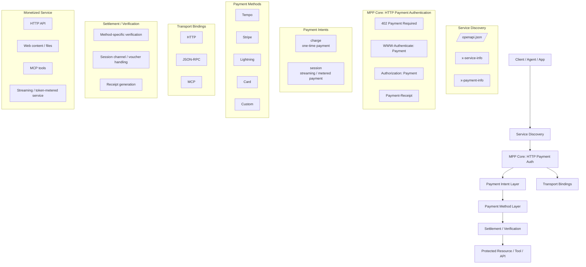
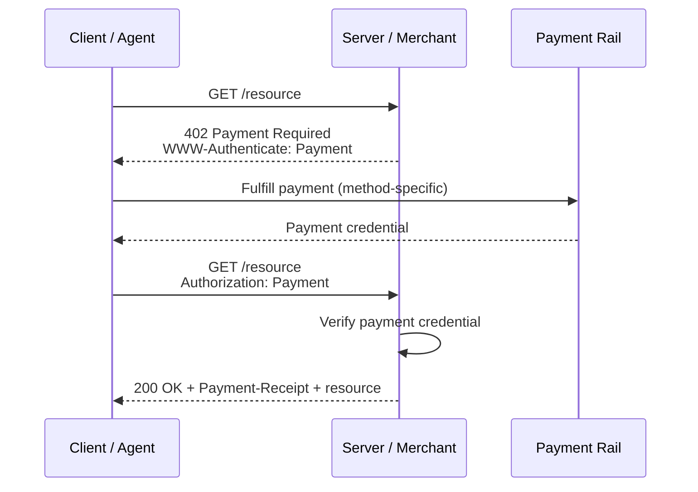
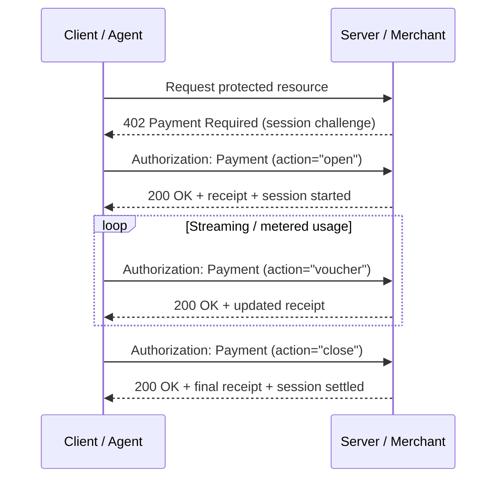

# Machine Payments Protocol (MPP): Participants and Protocol Architecture

_Last updated: March 21, 2026_

## Overview

The **Machine Payments Protocol (MPP)** is an open protocol for **machine-to-machine payments**. It is designed to let agents, applications, and services discover paid resources, fulfill payment challenges programmatically, and access those resources over standard internet interfaces such as HTTP.

MPP is best understood not as a single payment rail, but as a **protocol stack** that combines:

- service discovery,
- an HTTP payment authentication scheme,
- payment intent models,
- pluggable payment methods,
- transport bindings for HTTP / JSON-RPC / MCP,
- and method-specific settlement or verification.

## 1. Who is driving MPP?

### Primary protocol authors and lead vendors

The current public materials indicate that **Tempo Labs** and **Stripe** are the primary companies driving MPP.

- The official MPP site states that MPP is **“Designed by Tempo × Stripe.”**
- Stripe’s launch post describes MPP as an **open standard co-authored by Tempo and Stripe**.
- The core HTTP payment authentication draft lists authors from **Tempo Labs** and **Stripe**.

### Standards contributors visible in the public drafts

From the currently published draft documents, the most visible protocol authors are:

- **Brendan Ryan** — Tempo Labs
- **Jake Moxey** — Tempo Labs
- **Tom Meagher** — Tempo Labs
- **Jeff Weinstein** — Stripe
- **Steve Kaliski** — Stripe

In the discovery draft, additional authors from **Merit Systems** also appear:

- **R. Sproule** — Merit Systems
- **S. Ragsdale** — Merit Systems

### Ecosystem and implementation participants

Beyond the core authors, several companies are already visible in the public ecosystem:

- **Cloudflare** — adopter / integrator; Cloudflare Agents docs document MPP support and position it alongside x402.
- **Visa** — public design partner for card-related MPP work.
- **Tempo** — payment method and session-oriented rail.
- **Stripe** — payment method, developer tooling, and commercial integration path.
- **Lightning** — documented as a payment method family in the public specifications.

## 2. What is the current status of MPP?

As of March 2026, MPP appears to be in an **early but real deployment phase**:

1. **Public launch has happened**  
   MPP has a public website and public specification site.

2. **Reference specs are published**  
   The protocol family is published at `paymentauth.org`, including the Payment HTTP Authentication Scheme, Discovery, Charge, Session, and transport bindings.

3. **Standardization is still early**  
   The core HTTP payment authentication work is currently published as an **IETF Internet-Draft**, not as an RFC. That means it is still a work in progress.

4. **Live implementations already exist**  
   Cloudflare documents support for MPP in its Agents ecosystem, and Stripe has publicly launched MPP-related product support.

In practical terms, MPP is **usable and actively promoted**, but it is **not yet a mature finalized internet standard**.

## 3. Official websites and primary entry points

### Main project / protocol homepage

- **MPP homepage:** <https://mpp.dev>

### Specification hub

- **Specification site:** <https://paymentauth.org>

### Standardization / IETF draft entry

- **IETF Datatracker (Payment HTTP Auth draft):**  
  <https://datatracker.ietf.org/doc/draft-ryan-httpauth-payment/>

### Major vendor documentation

- **Stripe launch post:**  
  <https://stripe.com/blog/machine-payments-protocol>
- **Stripe machine payments docs:**  
  <https://docs.stripe.com/payments/machine/mpp>
- **Cloudflare MPP docs:**  
  <https://developers.cloudflare.com/agents/agentic-payments/mpp/>

## 4. MPP protocol architecture

Below is a protocol-centric architecture diagram for MPP.



## 5. Architecture explained layer by layer

### 5.1 Service Discovery

MPP includes an optional discovery layer. A service can publish an OpenAPI document, typically at:

```text
/openapi.json
```

That document can include:

- `x-service-info` — service metadata
- `x-payment-info` — per-operation payment metadata, such as intent, method, amount, and currency

Discovery improves client and agent usability, but the runtime **402 challenge remains authoritative**.

### 5.2 MPP Core: HTTP Payment Authentication

This is the protocol core.

The basic flow is:

1. A client requests a protected resource.
2. The server returns **402 Payment Required**.
3. The server includes a **`WWW-Authenticate: Payment`** challenge.
4. The client fulfills the payment requirement.
5. The client retries with **`Authorization: Payment`**.
6. The server verifies the credential and can return a **`Payment-Receipt`**.

This design makes payment behave like a formal HTTP authentication scheme rather than a one-off application convention.

### 5.3 Payment Intent Layer

MPP currently exposes two main public intent families:

- **`charge`** — one-time payment that settles immediately
- **`session`** — streaming or metered payment over a session / channel model

A useful mental model is:

- `charge` = pay once for this request
- `session` = open a paid session and spend against it over time

### 5.4 Payment Method Layer

MPP separates **how the client and server negotiate payment** from **which payment rail is used**.

Publicly visible payment methods currently include:

- **Tempo**
- **Stripe**
- **Lightning**
- **Card**
- **Custom**

This separation is one of MPP’s most important architectural properties. It means the protocol can stay stable even when the underlying payment rails differ.

### 5.5 Transport Bindings

MPP is not limited to plain HTTP page fetches.

Public specs and documentation also describe bindings for:

- **HTTP**
- **JSON-RPC**
- **MCP (Model Context Protocol)**

That makes MPP suitable not only for paid web APIs, but also for paid tool calls, paid MCP resources, and other agent-native interfaces.

### 5.6 Settlement / Verification

The lower layer is payment-method specific.

Examples include:

- on-chain verification,
- payment processor verification,
- session voucher handling,
- receipt generation,
- final settlement or reconciliation.

In other words, the core MPP layer standardizes the **challenge / credential / receipt** exchange, while the payment method specs determine how actual proof-of-payment works.

## 6. Dynamic flow examples

### 6.1 Charge flow



This is the simplest and most direct MPP usage pattern.

### 6.2 Session flow



This model is more suitable for streaming usage, token-metered services, and other high-frequency microbilling scenarios.

## 7. Can MPP support subscription-style payments?

**Probably yes at the product level, but not as a clearly standardized first-class core intent today.**

Here is the current picture from public materials:

- Cloudflare’s MPP documentation describes **two protocol intents**: `charge` and `session`.
- Stripe’s launch announcement says MPP enables **microtransactions, recurring payments, and more**.

The most reasonable interpretation is:

- **Recurring / subscription-like behavior is possible in the MPP ecosystem**, especially through vendor integrations, scheduled payment logic, or session-based models.
- But in the current public core protocol shape, **subscription is not presented as a separate top-level standard intent alongside `charge` and `session`**.

So today, it is safer to say:

> MPP can support recurring commercial models, but “subscription” does not yet appear to be a clearly standardized first-class core protocol intent in the public specs.

## 8. Why the architecture matters

MPP’s structure matters because it separates concerns cleanly:

- **Discovery** tells agents what can be bought.
- **HTTP auth semantics** define how payment challenges work.
- **Intents** define the commercial interaction pattern.
- **Methods** define the actual payment rail.
- **Transport bindings** let the same ideas work across HTTP APIs, JSON-RPC, and MCP.
- **Settlement** remains pluggable and rail-specific.

That makes MPP more than a paywall protocol. It is a **general machine-payments protocol stack** for agent-native services.

## 9. Source links

- MPP homepage — <https://mpp.dev>
- MPP specifications — <https://paymentauth.org>
- IETF draft index — <https://datatracker.ietf.org/doc/draft-ryan-httpauth-payment/>
- Stripe launch post — <https://stripe.com/blog/machine-payments-protocol>
- Stripe MPP docs — <https://docs.stripe.com/payments/machine/mpp>
- Cloudflare MPP docs — <https://developers.cloudflare.com/agents/agentic-payments/mpp/>
- Payment discovery draft — <https://paymentauth.org/draft-payment-discovery-00.html>

