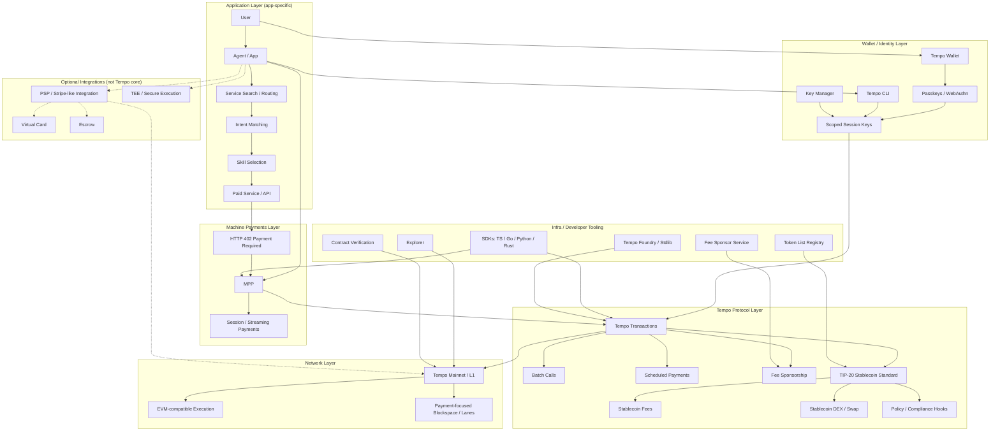
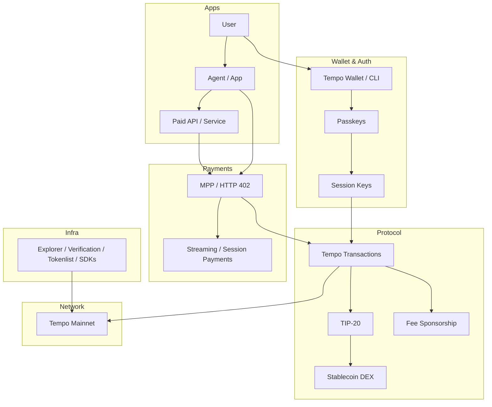
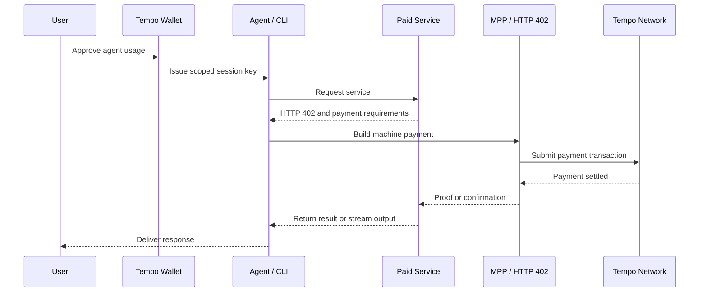

# Tempo Architecture Notes

This document contains three Mermaid diagrams for understanding Tempo:
1. Layered architecture
2. Simplified product overview
3. Agent payment sequence flow

---

## 1. Layered Architecture

---

## 2. Simplified Product Overview

---

## 3. Agent Payment Sequence

---

## 4. Architecture vs. Implementation Mapping

The theoretical layered architecture described above maps perfectly to the physical structure of Tempo's open-source repositories on GitHub. Tempo strongly enforces its modular design by mapping components cleanly into separate repositories.

| Architecture Layer | Physical GitHub Repository | Primary Language(s) | Purpose / Implementation Context |
| :--- | :--- | :--- | :--- |
| **Application Layer** | `tempoxyz/agent-skills` `tempoxyz/examples` | **TypeScript**, **Python** | App-specific workflows, skill selection, and AI agent execution integration examples. |
| **Machine Payments Layer (MPP)** | `tempoxyz/mpp` `tempoxyz/mpp-specs` `tempoxyz/pympp` `tempoxyz/mpp-rs` | **TypeScript**, **Python**, **Rust** | Protocol standards and multi-language SDKs focused on handling HTTP 402 payment cycles and sessions. |
| **Wallet / Identity Layer**| `tempoxyz/wallet` | **TypeScript**, **Go** | Implementation of passkey login, WebAuthn abstractions, and handling logic for scoped session keys. |
| **Infra & Developer Tooling** | `tempoxyz/tempo-apps` `tempoxyz/tempo-ts` `tempoxyz/tempo-go` | **TypeScript**, **Go** | Supporting infrastructure (explorer, contract verification, fee sponsorship) and application-level routing SDKs. |
| **Protocol (Contracts & State)**| `tempoxyz/tempo-foundry` `tempoxyz/tempo-std` | **Solidity**, **Rust** | Standard library, precompile interfaces, and custom Foundry tools required to deploy to the transaction and asset environments. |
| **Network & Execution Layer**| `tempoxyz/tempo` | **Rust** | The core node implementation logic for the L1 blockchain itself, including payment lanes and consensus. |